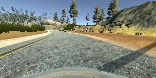
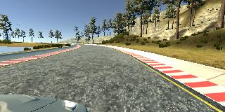

# **Behavioral Cloning** 

## Writeup Template


---

**Behavioral Cloning Project**

* The goals / steps of this project are the following:
 Use the simulator to collect data of good driving behavior
* Build, a convolution neural network in Keras that predicts steering angles from images
* Train and validate the model with a training and validation set
* Test that the model successfully drives around track one without leaving the road
* Summarize the results with a written report


[//]: # (Image References)

[image1]: ./examples/placeholder.png "Model Visualization"
[image2]: ./examples/placeholder.png "Grayscaling"
[image3]: ./examples/placeholder_small.png "Recovery Image"
[image4]: ./examples/placeholder_small.png "Recovery Image"
[image5]: ./examples/placeholder_small.png "Recovery Image"
[image6]: ./examples/placeholder_small.png "Normal Image"
[image7]: ./examples/placeholder_small.png "Flipped Image"

## Rubric Points
### Here I will consider the [rubric points](https://review.udacity.com/#!/rubrics/432/view) individually and describe how I addressed each point in my implementation.  

---
### Files Submitted & Code Quality

#### 1. Submission includes all required files and can be used to run the simulator in autonomous mode

My project includes the following files:

* **model.py** containing the script to create and train the model
* **drive.py** for driving the car in autonomous mode
* **NvidiaBasedModel.h5** containing a trained convolution neural network 
* **writeup_report.md** and **writeup_report.md** summarizing the results
* **NvidiaBasedTrainingModel.ipynb** as notebook file containing well organized same model as of **model.py**. I worked in notebook file and at the end converted this to **model.py** file

#### 2. Submission includes functional code
Using the Udacity provided simulator and my **drive.py** file, the car can be driven autonomously around the track by executing 
```sh
python drive.py NvidiaBasedModel.h5
```

#### 3. Submission code is usable and readable

The model.py file contains the code for training and saving the convolution neural network. The file shows the pipeline I used for training and validating the model, and it contains comments to explain how the code works.
Also, **NvidiaBasedTrainingModel.ipynb** contains exactly same code, which is more readable, divided into chunks like, Pre-processing, Main model, augmentation, etc.

### Model Architecture and Training Strategy

#### 1. An appropriate model architecture has been employed

After exploring different models like, AlexNet, comma.ai, and reading few forums-blogs, I finalized to use model decribed in [a paper by Nvidia](http://images.nvidia.com/content/tegra/automotive/images/2016/solutions/pdf/end-to-end-dl-using-px.pdf).  

The model includes ELU layers to introduce nonlinearity (refer model diagram or notebook file), and the data is normalized in the model using a Keras lambda layer.
 

#### 2. Attempts to reduce overfitting in the model

I started with using dropouts, spatial dropouts, also, tuned dropout's keep_prob but it didnt help much and L2 regularization genreated promising results.
The model contains L2 regularization in order to reduce overfitting (Nvidia paper based model design section in notebook). 

The model was trained and validated on data that Udacity provided and my driving data. The model was tested by running it through the simulator and ensuring that the vehicle could stay on the track all the times.

#### 3. Model parameter tuning

I used many of gradient descent optimizers like Momentum, Adagrad, Nadam, SGD, Adam, at least. Of all these, I had promising results from Adam where training and validation loss converged pretty consistently.
Hnece I used Adam optimizer, so the learning rate was not tuned manually.

#### 4. Appropriate training data

Training data provide by Udacity was not enough and vehicle was not recovering well by using only data provided. As per David's suggestion I drove vehicle in many different conditions and gathered many scenarios to recover vehicle on track, if diverted.
Also, I used images from left and right cameras of vehicle with some correction factor, this collectively made good collection of data in different scenarios. 


### Model Architecture and Training Strategy

#### 1. Solution Design Approach

The overall strategy for deriving a model architecture was to ...

My first step was to use a convolution neural network model similar to the AlexNet. However, it would be very time consuming to train the network and I already had used AlexNet before. To gain more exposure about different network, and to explore network that is recently used in the car for realtime application by Nvidia, I decided to use Nvidia research based network.

In order to gauge how well the model was working, I split my image and steering angle data into a training and validation set. I found that my first model had a low mean squared error on the training set but a high mean squared error on the validation set. This implied that the model was overfitting. This is the part where I struggled a lot. mse on these two sets was not consistent, it was always high on training set, indicating I need to focus on better regularization method. Initially I used dropout, spatial dropout, then, I tried using L2 regularization with tuned values. And at last, I had promising results than that of any combination of dropouts.

The final step was to run the simulator to see how well the car was driving around track one. There were a few spots where the vehicle fell off the track specifically, on the bridge and on the turn without lane markings.
At the end of the process, the vehicle is able to drive autonomously around the track without leaving the road. The happy moment arrived here!

#### 2. Final Model Architecture

The final model architecture consisted of a convolution neural network as follows:


#### 3. Creation of the Training Set & Training Process

To capture good driving behavior, I first recorded two laps on track one using center lane driving. Here is an example image of center lane driving:



I then recorded the vehicle recovering from the left side and right sides of the road back to center so that the vehicle would learn to adjust it's steering wheel measurement to get back in center of the lane, specifically while turning. These images show what a recovery looks like starting from ... :




To augment the data sat, I also flipped images and angles as suggested in lecture videos so as to have more reliable dataset in minimum driving and this would train network how to compute steering wheel measurement equivocally.

After the collection process, I had around 30,000 examples, if I include letf and right camera images it would be around 90,000 images. This is huge collection for the given problem assignment(I think).
When I plotted these examples with respective steering wheel measurements, I had a clear picture that most of images were to drive straight which would make vechicle to take biased decision. To reduce these samples, I implemeneted functionality using keep_prob that would delete entries once average expected measurements are reached.

I finally randomly shuffled the data set and put 20% of the data into a validation set. 

I used this training data for training the model. The validation set helped determine if the model was over or under fitting. The ideal number of epochs was 4-5 when I tried a lot with different number of epochs. I used an adam optimizer so that manually training the learning rate wasn't necessary.
Since I dont want to make this report too detailed or specific to circumstances, I would like mention learnings.

Finally, I would say, it has been great learning experience from following aspects:

* Explore new network based on Nvidia's research
* Understand and experience overfitting and it's solutions. Not one solution works to everyone, you need to undestand your network with your training data.
* Gradient descent optimizers like Adam, Adagrad, Nadam, SGD, Momentum on same training data in same environment. This was great experience to see all of these optimizers producing different results and then choose the best out of these
